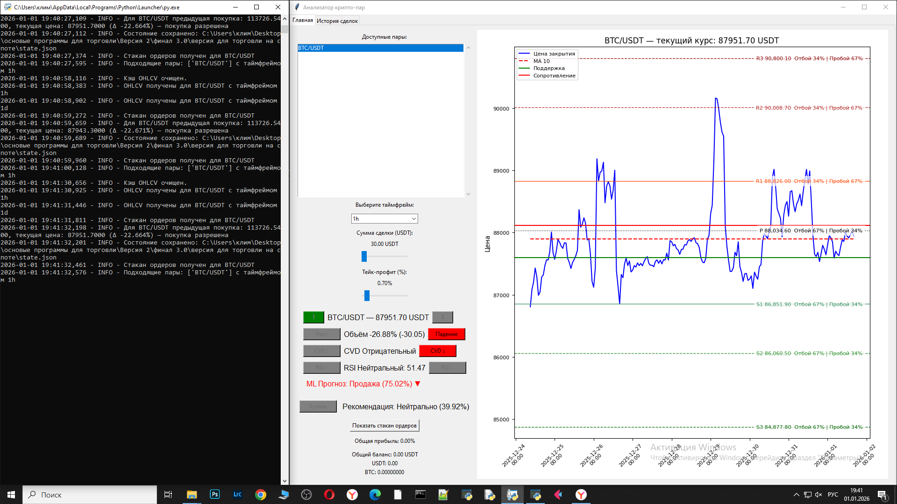

# Crypto Trading Bot — Торговый бот с машинным обучением

Автоматический спот-бот для биржи Bybit, который анализирует рынок с помощью технических индикаторов и сигналов машинного обучения для принятия решений о покупке/продаже.

  
*Главное окно с графиками, индикаторами, ML-прогнозами и рекомендациями по сделкам*
**Основные возможности:**
- Технические индикаторы: RSI, MACD, ADX, CVD, уровни Pivot (R1–S3)  
- Машинное обучение: ансамбль моделей RandomForest + XGBoost + LightGBM для предсказания вероятности роста/падения цены  
- Риск-менеджмент: trailing stop, ATR-стопы, grid-ордера, учёт комиссий и проскальзывания, cooldown между сделками  
- Интерфейс на Tkinter с графиками (Matplotlib), рекомендациями и логами  
- Уведомления в Telegram при сигналах и сделках  
- Обучение ML на данных нескольких символов с использованием order_book  
- Dry-run режим для тестирования без реальных ордеров  

**Технологии:**
- Python  
- ccxt (Bybit)  
- pandas, numpy  
- scikit-learn, xgboost, lightgbm  
- matplotlib, tkinter  
- concurrent.futures (параллельный fetch данных)  
- requests (Telegram)  
- logging + Telegram-уведомления при событиях

## Как запустить локально

1. Склонируй репозиторий  
   ```bash
   git clone https://github.com/klimyalta/crypto-trading-bot-.git
   cd crypto-trading-bot
